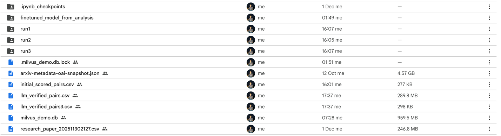

# Scholar Stream: ArXiv Research Paper Semantic Search

This project is a web-based semantic search application designed to search a dataset of ArXiv research papers. It provides a user interface to compare search results from a base sentence-transformer model against a fine-tuned version of the same model, showcasing the impact of fine-tuning on search relevance.

The application is built with Flask, uses Milvus Lite for efficient vector search, and is containerized with Docker for easy setup and deployment.

## Features

- **Semantic Search:** Understands the meaning behind a query, not just keywords.
- **Model Comparison:** Directly compare results from a base model (`all-MiniLM-L6-v2`) and a custom fine-tuned model.
- **Efficient Vector Database:** Uses Milvus Lite to store and search document embeddings with high performance.
- **Web Interface:** A simple, clean UI to enter queries and view sorted, de-duplicated results.
- **Production-Ready:** Containerized with a production-grade Gunicorn WSGI server, ready for deployment on platforms like Google Cloud Run.

## Screenshot

### UI Application screenshot


### Files screenshot (from personal gdrive)
Below shows the files like finetuned model, and csv papers


# Application UI URL

https://cloudrun-456311304734.us-east1.run.app/

## How It Works

The application loads a dataset of research papers and uses two different sentence-transformer models to generate vector embeddings for each paper's title and abstract. These embeddings are stored in two separate collections within a single Milvus Lite database file.

When a user enters a query:
1.  The query is encoded into a vector by both the base and the fine-tuned models.
2.  The application first searches the **custom collection** (fine-tuned model) to get the most relevant results.
3.  It then searches the **base collection**, filtering out any paper IDs that were already found in the custom search to ensure results are unique.
4.  The results from both collections are combined, sorted by relevance score, and displayed in the UI, with clear labels indicating which model found each result.

## Fine-Tuning with LLM as Judge

The custom model was fine-tuned using the **"LLM as Judge"** technique to create a high-quality training dataset. This process involved:

1.  **Generating Question/Answer Pairs:** A powerful LLM (like GPT-4) was used to read through the research papers and generate relevant questions and answers based on their content.
2.  **Creating Training Triplets:** These question/answer pairs were then used to form "triplets" for training. Each triplet consists of:
    - **Anchor:** A question generated from a paper.
    - **Positive:** The corresponding answer from the same paper.
    - **Negative:** An answer from a different, unrelated paper.
3.  **Fine-Tuning the Model:** The sentence-transformer model was then fine-tuned on these triplets. This process teaches the model to place the vector embeddings of the anchor (question) and the positive (correct answer) closer together in the vector space, while pushing the negative (wrong answer) farther away.

This technique allows the model to develop a more nuanced understanding of semantic relevance, leading to significantly improved search results compared to the base model.

## Project Structure

```
.
├── app.py                  # Main Flask application logic
├── Dockerfile              # Docker configuration for building the container
├── requirements.txt        # Python dependencies
├── README.md               # This file
└── app/
    ├── papers.csv          # Dataset of ArXiv papers
    ├── milvus_demo.db      # Milvus Lite database file
    └── finetuned_model_from_analysis/ # Directory containing the fine-tuned model
```

## Setup and Running the Project

This project is designed to be run inside a Docker container, which handles all dependencies and setup.

### Prerequisites

- [Docker](https://www.docker.com/get-started)

### Running the Application

1.  **Clone the repository:**
    ```bash
    git clone <repository-url>
    cd cloud_run
    ```

2.  **Build the Docker image:**
    From the root directory of the project, run the following command to build the image.
    ```bash
    docker build -t arxiv-search-app .
    ```

3.  **Run the Docker container:**
    Once the image is built, run the container, mapping the container's port 8080 to your local machine's port 8080.
    ```bash
    docker run -p 8080:8080 arxiv-search-app
    ```

4.  **Access the application:**
    Open your web browser and navigate to [http://localhost:8080](http://localhost:8080). You should see the search interface.

## API Endpoint

The application also exposes a `GET` endpoint for programmatic searching.

- **URL:** `/api/search`
- **Method:** `GET`
- **Query Parameter:** `q` (string, required) - The search term.

### Example Usage

```bash
curl "http://localhost:8080/api/search?q=LLMs%20and%20reasoning"
```

This will return a JSON object containing the query and the de-duplicated search results from both the base and custom models.

## Configuration

The application can be configured using the following environment variables, which are set to default values in the `Dockerfile`:

- `PORT`: The port on which the Gunicorn server runs (default: `8080`).
- `INPUT_CSV_PATH`: Path to the paper dataset CSV file.
- `MILVUS_DB_PATH`: Path to the Milvus Lite database file.
- `MODEL_NAME`: The name of the base sentence-transformer model.
- `FINETUNED_MODEL_PATH`: Path to the directory containing the fine-tuned model.

## Deployment

This application is configured for production and can be deployed to any platform that supports Docker containers, such as Google Cloud Run, AWS Elastic Beanstalk, or Heroku. The `Dockerfile` uses a Gunicorn WSGI server to run the Flask application securely and efficiently.
